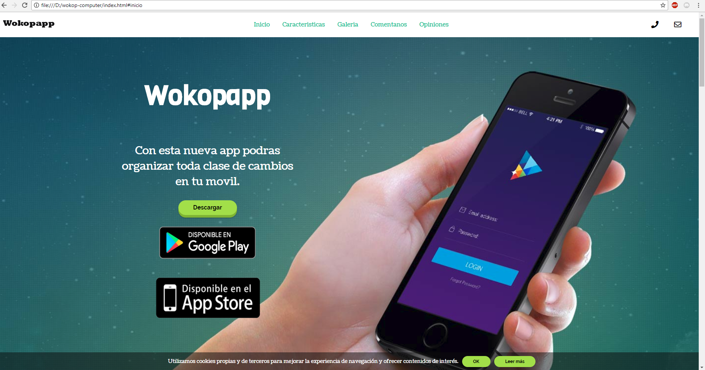

# Wocop computer

## Descripción

Este proyecto trata de una pagina (Landing page) para promocionar una app para android.

## Perfiles de usuario

| Descripción | Enlaces | Observaciones |
|--------|--------|--------|
|   Codepen     |   [https://codepen.io/DMR93/ ](https://codepen.io/DMR93/)     |   mi perfil de codepen     |
|     Github   |   [https://github.com/DMR93](https://github.com/DMR93)     |   mi perfil de github     |
|      Proyecto  |   [https://dmr93.github.io/wokop-computer/](https://dmr93.github.io/wokop-computer/)     |   mi proyecto      |

## Herramientas utilizadas

- Draw.io:  [https://www.draw.io/](https://www.draw.io/)
- Trello: [https://trello.com](https://trello.com)
- Atom: [https://atom.io/](https://atom.io/)
- Font awesome: [https://fontawesome.com](https://fontawesome.com)
- Haroopad: [http://pad.haroopress.com/](http://pad.haroopress.com/)
- Google fonts: [https://fonts.google.com/](https://fonts.google.com/)
- Font cdn: [https://fontcdn.org/](https://fontcdn.org/)
- Real Favicon generator: [https://realfavicongenerator.net/](https://realfavicongenerator.net/)

## Librerias utilizadas

-jQuery:  [https://jquery.com/](https://jquery.com/)
-MenuSpy: [https://github.com/lcdsantos/menuspy](https://github.com/lcdsantos/menuspy)
-Tiny-Slider: [https://github.com/ganlanyuan/tiny-slider](https://github.com/ganlanyuan/tiny-slider)
-AOS: [https://michalsnik.github.io/aos/](https://michalsnik.github.io/aos/)
-Tippy: [https://atomiks.github.io/tippyjs/](https://atomiks.github.io/tippyjs/)
-jQuery Cookiebar: [https://github.com/carlwoodhouse/jquery.cookieBar](https://github.com/carlwoodhouse/jquery.cookieBar)

## Fase 1: Boceto inicial de la página

## Fase 2: Cambios en el boceto

## Ultima Fase: Screenshot de la pagina web

